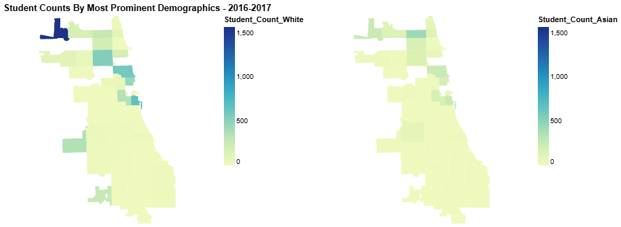
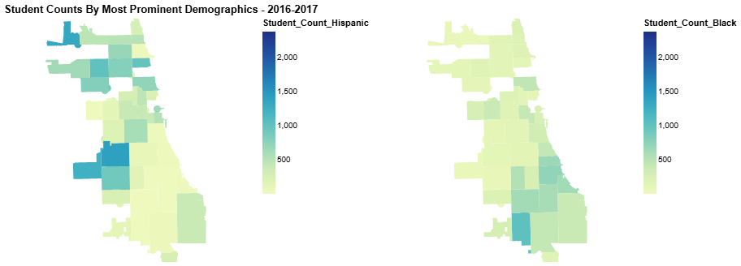
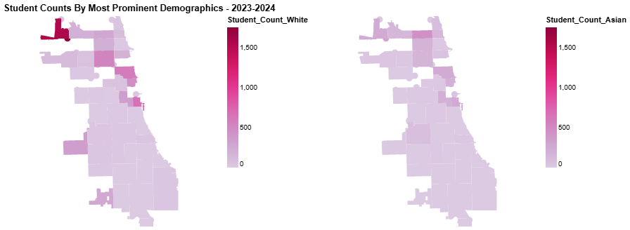
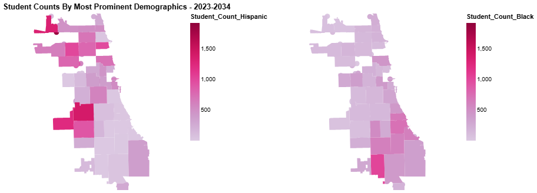
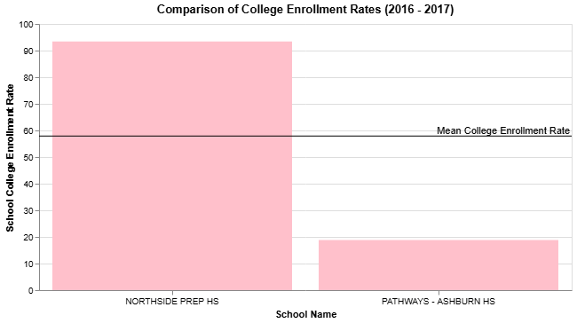
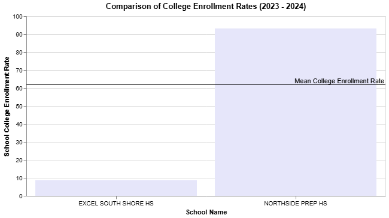
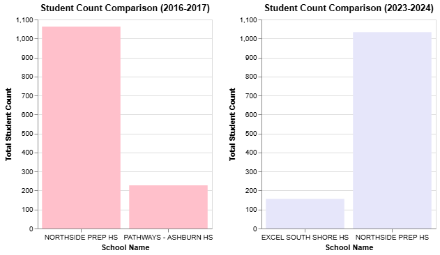
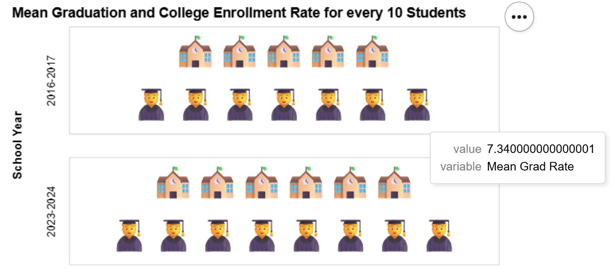
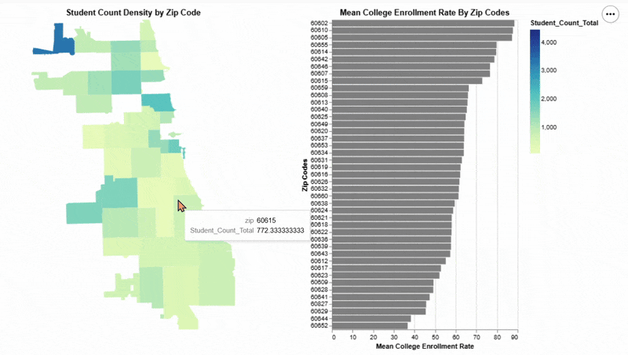
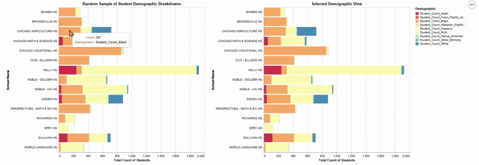

# CPS-Exploratory-Visualizations

The purpose of this project is to go through the process of developing exploratory visualizations with the usage of a large dataset, first conceptualizing possible ways to display information by hand, and then proceeding to recreate these ideas with real data. The two datasets chosen are the school profile information of public schools in Chicago, the first one being for the 2016-2017 school year, and the second being for the 2024-2023 school year. The 16-17 dataset contains 661 rows, each corresponding to a different school, and 91 columns of different identifying attributes for each school, such as whether it is a high school, middle school, or elementary school, student demographics, and other information relating to academic statistics. The 23-24 dataset contains 652 rows and 99 columns, containing the same information above. Questions regarding the datasets were developed as they were cleaned and explored, following which visualizations were created to picture any insights.

## Question 1: How do the student demographic counts vary across school years?, and how are these counts distributed across the Chicagoland area?
This question seeks to examine the spread of student demographics, so as to see which areas on the map are more populated than others. For this task, I chose to focus only on the 4 most prominent demographics observed in the data. This was achieved through a choropleth map with the chicago zip code boundaries as the dividing points for each category. The initial plan had been to use the school district boundaries, but this was not achievable due to difficulty finding a geojson file containing the relevant data. Two sets of graphs were created, to compare the demographic spread in 2016-2017 to 2023-2024 as well. 

In the first set of visualizations, we can see that each demographic is concentrated more in different parts of the map, with the count of Hispanic students appearing larger in areas towards the left of the map, and the count of Black students being represented in the bottom right. There is a notable concentration of White students in one zip code boundary towards the top left of the map, with a count of 1,500+ students. With the data selection in the current dataset, there does not appear to be a strong concentration of Asian students in any particular part of the map. One notable detail is the areas of the map that are very concentrated in one demographic seem to show a weaker presence for others, which is especially noticeable in the section of the map strongly concentrated in White and Hispanic students.

When compared to the second set of visualizations for the 2023-2024 school year, there does not appear to be any drastic shifts. The relative concentrations of each demographic seem to be the same after a period of 6 years.

Through these spatial visualizations we can see the concentration of certain high school student demographics across the chicagoland area, with the 4 most prominent demographics within the dataset being chosen. This specific type of visualization allows the user to compare the various regions within the city where there may be a higher or lower presence of one ethnicity. These comparisons can be important in guiding the direction of an analysis of a given dataset, as it allows the user to see points of interest to focus on when examining other attributes. A choropleth map in particular was chosen due to the generalized view it gives of the data, functioning more as a stepping stone for further analysis. The color gradient is intuitive and allows any user to understand and pinpoint the highlighted locations on the map.

## Question 2: Is there an improvement in academic prospects for students across the two school years?
This question aims to examine if there is a palpable shift in academic prospects for students (college enrollment rates, graduation rates), in the years prior to Covid-19 and the years after. The approach to this task was to examine specific schools within the dataset based on these attributes and compare them to the mean value. For simplicity, the high school with the lowest and highest college enrollment rates were selected for visualization. To compare with the 2023 school year, the same school was selected for highest college enrollment rate, but the lowest was chosen to be a different school after being unable to locate the previously used school in the new dataset.

The difference in the lowest and highest college enrollment rates are very stark, and their placements relative to the mean also show this disparity. The college enrollment rate for the "highest" school did not appear to change significantly across the two visualizations. The low point of the dataset dropped significantly, by ten percent, although these are not the same school.

However, it is important to assess the other points of comparison between the two schools, and verify whether a comparison at this level is justified.

The student counts for each school was plotted against each other, to show that the enrollment count in each school is drastically different, with the lowest ranked schools not even reaching half of the student count for the highest ranking school. Of 1,000 students, 90% of them went on to enroll in college, and of 100-200 students, 8-18% went on to enroll in college. There is not enough of a significant difference in this variable for either school to answer the question posed in this section.

The last visualization implemented for this question was a pictoral graph created using emojis to represent graduation rate and college enrollment rate.

The mean rates for each variable were transformed to a scale of ten in order to visualize them with this method, rounding down to the floor for each value. To remedy this less informative representation of the mean values, a tooltip was added to display the decimal value when hovering over the respective emoji. The two sets of variables are separated by year, so as to compare them more effectively. We can see that the mean rate for both college enrollment and graduation has improved across the years displayed. The limitations of this graph are apparent in the display for the first variable, as the improvement appears greater in the graph than in actuality, going from 57.9% to 61.8%. The improvement for graduation rates do appear to be significant, going from 73.4% to 83.7%.

## Interactive and Linked Visualizations
To go further than simple and static means of viewing the data, more interactive visualizations were developed, taking user input to display specific information, or offering further information on parts of a graph. 

### Mean College Enrollment by Zip Codes

This visualization utilizes a choropleth map and a bar chart to display the mean college enrollment rate in each zip code boundary. When selecting one or multiple sections of the map, the corresponding zip code is added to the bar chart to compare with other selected zip codes. A tooltip allows for a more detailed view of enrollment rates as well as total student count when hovering over the graph and the map respectively. With the chosen attributes and the way that the visualization is designed, we can simultaneously observe the relationship between location and student count, as well as location and college enrollment rates. The user is able to choose an area of interest and observe how it might compared to an area that is more or less populated. Using the tooltips, they can get further information not provided by the visuals.

Initially I had wanted to color each bar according to the zip code so that they would be easily distinguishable when displayed on top of one another, but after applying this change and testing it, it became clear that the color was overwhelming when displayed all together. The range of colors did not add any meaningful information to the visualization and only cluttered it, so it was removed in favor of one simple color. Because this graph is meant to only include the selections of the map the user is interested in, I decided the color did not need to denote anything extra.

### Student Demographic Breakdown In Sampled Schools

The last linked visualization is a horizontal stacked bar chart, where the attributes being displayed are the various student demographic counts. This visualization is created from a random sample of schools within the dataset, in order to focus on a smaller subset, while also seeing how different schools across the district may vary greatly in their student body. A random sample of 15 was chosen for this, as I did not want to clutter the graph unecessarily, while still choosing more than a handful of schools. The interactions in this visualization allow for the user to click on partitions in the bars to observe them isolated against the same demographic in other schools. Due to the range of data contained in this sample, we can see which demographics maintain a strong presence in multiple schools, and which ones vary. The downsides of this particular interaction choice is that it does not mesh well with counts that may be too small to be visible clearly on the graph. It is possible to interact with them, but it will not be visualized clearly. The addition of the tooltip mitigates this somewhat, as the number of students in each category is listed when the corresponding section of the graph is hovered over. In the previous iterations of this graph, I had been considering utilizing a pie chart initially, but thought that when considering possible interactions & displaying more subsets of the data, it made more sense to utilize a bar chart.
